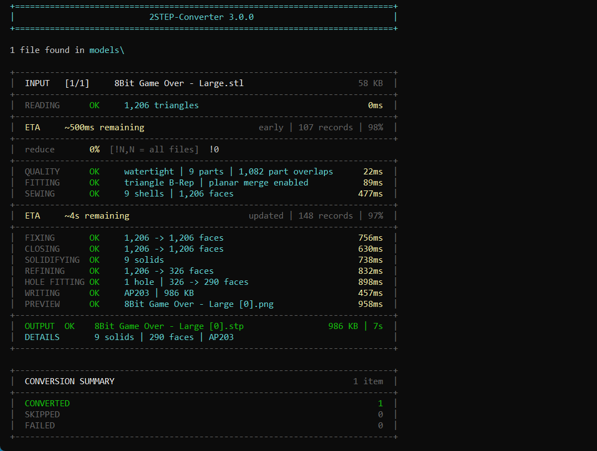

# 2STEP-Converter

> Converts **STL, 3MF, OBJ, AMF, and IGES** files to clean STEP solids using OpenCASCADE - the CAD kernel used by FreeCAD and many engineering applications.

Current version: **3.0.0**




If this project helps you, you can support development on Ko-fi:

[](https://ko-fi.com/yaneony)

---

The name has a deliberate double meaning: **"to STEP"** - whatever format you throw at it, the output is always a clean STEP file - and **"two steps"** - drop your files into `models/`, run the launcher. Unlike online converters that wrap the mesh as-is in a STEP container (leaving thousands of flat triangular faces), 2STEP-Converter sews the mesh into a proper solid, repairs it, and merges co-planar faces - the same pipeline FreeCAD uses internally.

> [!TIP]
> **Self-contained.** No system Python, no admin rights, no PATH changes. The launcher creates a portable environment from the exact package versions in `src/environment.yml`.


*Left: typical online converter. Right: 2STEP-Converter. Same source file.*


*Auto-generated `.png` previews showing the same model at 20%, 40%, 60%, and 80% reduction.*

---

## Table of Contents

- [What to Expect](#what-to-expect)
- [Installation](#installation)
- [Usage](#usage)
- [First Run](#first-run)
- [How It Works](#how-it-works)
- [Geometry Fidelity](#geometry-fidelity)
- [Configuration](#configuration)
- [Troubleshooting](#troubleshooting)
- [Limitations](#limitations)
- [Requirements](#requirements)
- [Project Structure](#project-structure)
- [Credits](#credits)
- [Disclaimer](#disclaimer)
- [License](#license)

---

## What to Expect

2STEP-Converter turns mesh geometry into validated STEP B-Rep solids. The stable default path is not a parametric reverse-engineering system, so the result does not regain the sketches, constraints, dimensions, feature tree, or design intent from the original CAD model. An opt-in experimental mode can reconstruct narrowly defined features when every safety check passes.

| Source geometry | Expected result |
|-----------------|-----------------|
| Clean, closed, consistently oriented mesh | One or more valid STEP solids that preserve the tessellated shape within the enabled repair and fitting tolerances. |
| Large co-planar triangle regions | Usually merged into fewer planar CAD faces. |
| Confidently recognized complete spheres, cylinders, and cones | Replaced by exact analytic CAD surfaces. |
| Complete linear extrusion with matching planar end profiles | Rebuilt as an exact profile prism when experimental parametric reconstruction is enabled. |
| Verified straight through-holes and flat-bottomed blind holes | Replaced by analytic cylindrical cuts. |
| Freeform curves, threads, fillets, text, organic shapes, and ambiguous holes | Preserved as faceted B-Rep geometry. They can still belong to a real solid. |
| Several disconnected closed mesh parts | Exported as several solids in one STEP file. |
| Open, non-manifold, self-intersecting, or badly damaged mesh | Repaired only when the enabled conservative operations can do so safely. Otherwise conversion fails or keeps the affected region faceted. |

Strict validation guarantees that every exported topology component belongs to a valid solid when `REQUIRE_SOLID_OUTPUT` and `VALIDATE_STEP_AFTER_WRITING` are enabled. It does not guarantee that a damaged input was repaired according to the original designer's intent, or that every dimension remained exact after mesh reduction or analytic fitting.

Before using an output for manufacturing or other critical work:

1. Confirm the preview reports the expected solid count.
2. Open the STEP file in a CAD application and confirm that the bodies are solids.
3. Measure critical dimensions, wall thicknesses, hole diameters, and hole depths.
4. Inspect small features, curved regions, threads, and repaired areas.
5. Use `--reduce 0` when fidelity matters more than output size.

STL and OBJ files do not provide reliable standard model units. Their numeric coordinates are used as supplied, so verify the imported dimensions in CAD. 3MF and AMF units and instance transforms are applied during loading.

---

## Installation

No system Python required - the launcher creates a self-contained portable environment on first run.

1. **Download** the project:
   - Click the green **Code** button on the [repository page](https://github.com/yaneony/2STEP-Converter) and choose **Download ZIP**
   - Or grab the latest tagged release from [Releases](https://github.com/yaneony/2STEP-Converter/releases)
   - Or clone with git: `git clone https://github.com/yaneony/2STEP-Converter.git`

2. **Extract** the archive to a folder of your choice. Keep the path short on Windows (e.g. `C:\Tools\2STEP-Converter`) to avoid the 260-character path limit - see [Windows 260-character path limit](#windows-260-character-path-limit).

3. **Run the launcher.** First launch auto-installs micromamba and all dependencies (~7.5 GB on disk, 5-15 min depending on connection speed):
   - **Windows** - double-click `2STEP-Converter.bat`
   - **macOS / Linux** - make executable once with `chmod +x 2STEP-Converter.sh`, then `./2STEP-Converter.sh`

4. The launcher will ask once where to install the Python environment: **portable** (next to the script in `lib/`) or **platform default** (under your user profile). See [Install location](#install-location) for the exact paths and trade-offs.

5. Once the environment is built, drop input files into `models/` and run the launcher again - or pass files on the command line. See [Usage](#usage).

> [!TIP]
> No admin rights are required unless you opt into enabling Windows long paths during install. See [First Run](#first-run) for what gets downloaded and where it lives on disk.

---

## Usage

### Batch mode

1. Drop files into the `models/` folder
2. Run the launcher:
   - **Windows** - double-click `2STEP-Converter.bat`
   - **macOS / Linux** - `./2STEP-Converter.sh` (one-time `chmod +x 2STEP-Converter.sh`)
3. Output `.stp` files appear in the same folder

**Supported formats:** `.stl` `.3mf` `.obj` `.amf` `.igs` `.iges`

### Single file

**Windows**
```bat
2STEP-Converter.bat model.stl
2STEP-Converter.bat model.stl -o out.stp
```

**macOS / Linux**
```sh
./2STEP-Converter.sh model.stl
./2STEP-Converter.sh model.stl -o out.stp
```

### Multiple files

Pass any number of files directly - no need to use the `models/` folder:

**Windows**
```bat
2STEP-Converter.bat a.stl b.obj c.3mf
```

**macOS / Linux**
```sh
./2STEP-Converter.sh a.stl b.obj c.3mf
```

### Options

| Option | Default | Description |
|--------|:-------:|-------------|
| `--tolerance` / `-t` | `0.01` | Sewing tolerance in model units. Lower = tighter seams, slower. Increase if sewing fails on coarse meshes. |
| `--reduce` / `-r` | off | Reduce mesh by this % of triangles (e.g. `10` keeps 90%). Comma-separated values produce one output per value (e.g. `25,50,75` writes three `.stp` files). |
| `--output` / `-o` | - | Output file path (single-file mode only). |
| `--output-dir` / `-d` | - | Write all outputs to this directory instead of alongside the source. Later inputs that target an already claimed output name are skipped. |
| `--format` | `ap203` | STEP schema: `ap203`, `ap214`, or `ap242`. |
| `--force` / `-f` | off | Re-convert the source even when its output file is newer. |
| `--dry-run` / `--dry` | off | Show what would be converted or skipped without doing anything. |
| `--watch` / `-w` | off | Start watching `models/` after the initial batch, even when the folder is empty. New, changed, and previously failed files are retried after their size and timestamp stabilize. Ctrl+C to stop. |
| `--preview` / `--no-preview` | from config | Force the `.png` preview on or off (overrides `GENERATE_PNG_PREVIEW`). |
| `--experimental-parametric` / `--no-experimental-parametric` | from config | Enable or disable experimental exact linear-extrusion reconstruction. The stable fallback remains active. |
| `--pause` / `--no-pause` | automatic | Force or suppress the final 'Press Enter' prompt. By default it appears only in an interactive terminal. |
| `--version` | - | Print the application version and exit. |

> [!NOTE]
> Output files are named `<source-name> [N].stp` where `N` is the reduction percentage (`0` if no reduction was applied). For example, `model.stl` becomes `model [0].stp`.
> Reduction values must be at least `0` and less than `100`; decimal percentages with up to nine significant decimal places are supported and receive distinct output names.
> Each successful conversion produces `model [N].stp` and, when previews are enabled, `model [N].png`. No conversion JSON sidecar is created.
> Inputs such as `model.stl` and `model.3mf` target the same output names. Within one batch, the first successful source keeps the output name and later conflicting sources are skipped. Across separate runs, an existing output is skipped only when it is newer than the source, converter, and configuration. A required preview must also be current. Explicit `--tolerance`, `--format`, or experimental parametric switches bypass this cache, as does `--force`.

**Windows**
```bat
2STEP-Converter.bat --reduce 25 model.stl
2STEP-Converter.bat --reduce 25,50,75 model.stl
2STEP-Converter.bat --format ap214 -d C:\out model.stl
2STEP-Converter.bat --experimental-parametric model.stl
2STEP-Converter.bat --no-preview --dry-run
2STEP-Converter.bat --watch
```

**macOS / Linux**
```sh
./2STEP-Converter.sh --reduce 25 model.stl
./2STEP-Converter.sh --reduce 25,50,75 model.stl
./2STEP-Converter.sh --format ap214 -d ~/out model.stl
./2STEP-Converter.sh --experimental-parametric model.stl
./2STEP-Converter.sh --no-preview --dry-run
./2STEP-Converter.sh --watch
```

### Interactive reduction prompt

When `ASK_FOR_REDUCTION` is enabled (default), each file pauses on a reduction prompt when running in an interactive terminal. Passing `--reduce` or redirecting input disables the prompt.

| Input | Result |
|-------|--------|
| **Enter** | Accept the default (from `DEFAULT_REDUCTION_PERCENT` or `--reduce`) |
| `25` | Reduce this file by 25% |
| `25,50,75` | Generate three outputs at 25%, 50%, and 75% reduction |
| `!25` or `!25,50` | Lock the value for all remaining files in the batch |
| `0` | No reduction for this file |

---

## First Run

On first launch the launcher downloads everything automatically:

| Download | Size | Purpose |
|----------|:----:|---------|
| micromamba | ~10 MB | Portable Python environment manager |
| Python 3.12 + pythonocc-core | ~500 MB | OpenCASCADE bindings (compressed download) |
| trimesh + fast-simplification | ~10 MB | Mesh reduction fallbacks |
| NetworkX | ~2 MB | Boundary-cycle analysis for optional hole filling |
| matplotlib | ~50 MB | Preview rendering |
| open3d | ~150 MB | Mesh repair and primary reducer |

The micromamba executable is pinned to a specific release and verified with its published SHA-256 digest before execution. Direct Python dependencies are pinned exactly in `src/environment.yml`. The launcher stores the specification checksum inside the environment and runs a dependency update whenever that checksum changes. If an environment becomes incomplete or an import is broken, the launcher force-reinstalls the pinned packages from the same specification and verifies all required imports again.

Total fresh install: ~**7.6 GB** on disk, split roughly in half between the live env and an extracted-package mirror:

| Folder | Size | What it is |
|--------|:----:|------------|
| `lib\env\` | ~3.5 GB | The active Python environment (what gets used at runtime) |
| `lib\https\` | ~4.1 GB | micromamba's **extracted-package mirror** - not compressed; one extracted copy of every package |
| `lib\micromamba.exe` + bookkeeping | ~15 MB | Env manager + small caches |

### Why so large?

**Inside `lib\env\` (~3.5 GB):**

- ~1.6 GB in `Library\bin\` - native DLLs. Biggest: MKL (~280 MB across multiple kernels), Qt6 (~70 MB), libclang (~125 MB), VTK (~150 MB), Mesa/Vulkan software renderers (~110 MB), Open3D (~34 MB).
- ~700 MB in `Lib\site-packages\` - Python packages. Biggest: `OCC` (308 MB), `open3d` (79 MB), `plotly` (57 MB), `vtkmodules` (43 MB), `PySide6` (38 MB), `numpy` (30 MB), `dash` (29 MB), `matplotlib` (26 MB).
- Roughly **~170 MB** of that `site-packages` total is indirect visualization dependencies (`plotly`, `dash`, `PySide6`, `vtkmodules`) pulled in by Open3D's optional renderer code but not used by the converter.
- ~1.2 GB in `Library\lib\`, `Library\share\`, and other support folders.
- Open3D and Qt6 also bundle their own **copies** of native DLLs inside `site-packages` (e.g., `Open3D.dll` exists once in `Library\bin\` and once in `site-packages\open3d\cpu\`), so some content is duplicated within the env itself.

**`lib\https\` (~4.1 GB):**

This is **not** a compressed cache - it's micromamba's package directory. Every conda package is extracted in full here (e.g., `mkl` 425 MB, `qt6-main` 372 MB, `vtk-base` 346 MB, `pythonocc-core` 314 MB, `open3d` 210 MB) so that envs can be (re)built quickly by linking files out of this mirror. On filesystems where hardlinks across the directories aren't available - which is the common case on Windows - the contents end up as full copies, effectively doubling the disk usage.

> [!WARNING]
> Don't manually strip files inside `lib\env\`. Many Python packages import their bundled native libraries from a specific path inside `site-packages\`, and removing or symlinking those copies silently breaks `import` - often only at runtime.
>
> The only safe cleanup is deleting `lib\https\` once the env is built. This recovers ~4 GB, but the launcher will re-download and re-extract every package if the environment is rebuilt after manually deleting `lib\env\`.

### Install location

The launcher checks for an existing environment in this order:

1. `lib/` next to the script - used if present (portable mode)
2. Platform default - used if present
3. Neither found - you are asked where to install

| Platform | Default path |
|----------|--------------|
| Windows | `%LOCALAPPDATA%\2STEP-Converter` |
| macOS | `~/Library/Application Support/2STEP-Converter` |
| Linux | `~/.local/share/2STEP-Converter` (respects `$XDG_DATA_HOME`) |

### Windows 260-character path limit

> [!IMPORTANT]
> The Python environment contains deeply nested paths that can exceed Windows' default 260-character limit, causing silent failures. On startup the launcher detects this and offers two options.

| Option | What it does |
|--------|--------------|
| **\[1\] Enable long paths** | Writes `LongPathsEnabled = 1` to the registry via a UAC prompt, then exits so you can restart Windows when convenient. |
| **\[2\] Use %LOCALAPPDATA%\2STEP-Converter** | Installs under your user profile where paths are shorter. No restart needed. |

To enable long paths manually in an elevated PowerShell:

```powershell
Set-ItemProperty -Path "HKLM:\SYSTEM\CurrentControlSet\Control\FileSystem" -Name LongPathsEnabled -Value 1
```

Then reboot. This does not apply to macOS or Linux.

---

## How It Works

Replicates the FreeCAD **Part workbench** conversion pipeline. Mesh inputs (STL/3MF/OBJ/AMF) go through a mesh-cleanup stage first, then a CAD-kernel stage. IGES inputs skip straight to the CAD stage since they already contain B-Rep geometry.

| Step | Operation | Library / API |
|:----:|-----------|---------------|
| 1 | Parse input into vertex/triangle arrays, applying 3MF/AMF units and instance transforms, including 3MF Production Extension model paths and concave OBJ polygon triangulation | Custom parsers for STL/3MF/OBJ/AMF; `IGESControl_Reader` for IGES |
| 2 | Repair mesh, merge nearby vertices, and orient triangles | NumPy; `open3d`; optional `trimesh` hole filling |
| 3 | Diagnose boundaries, non-manifold edges, components, and self-intersections | NumPy; `open3d` |
| 4 | Reduce mesh with boundary weighting and dimension, volume, component-count, and topology checks (optional) | `open3d` (primary); `trimesh` and `fast-simplification` (fallbacks) |
| 5 | Reconstruct confident complete spheres, cylinders, and cones, plus opt-in complete linear extrusions, as exact CAD geometry | NumPy; `BRepPrimAPI`; `BRepBuilderAPI` |
| 6 | Build a triangle B-Rep when analytic reconstruction does not apply | `StlAPI_Reader` |
| 7 | Sew triangles into shells with a scale-aware tolerance | `BRepBuilderAPI_Sewing` |
| 8 | Repair invalid B-Rep geometry | `ShapeFix_Shape` |
| 9 | Close only small planar B-Rep gaps within configured edge and area limits | `ShapeAnalysis_FreeBounds`; `BRepBuilderAPI_MakeFace` |
| 10 | Promote valid closed shells into solids | `BRepBuilderAPI_MakeSolid`; `BRepCheck_Analyzer` |
| 11 | Merge co-planar faces separately inside each solid | `ShapeUpgrade_UnifySameDomain` |
| 12 | Reconstruct safely verified straight through-holes and blind holes as analytic cylindrical cuts | `BRepAlgoAPI_Cut`; `BRepPrimAPI_MakeCylinder`; `BRepClass3d_SolidClassifier` |
| 13 | Atomically export STEP, read it back, and validate every topology component | `STEPControl_Writer`; `STEPControl_Reader`; `BRepCheck_Analyzer` |

The expensive sewing, fixing, refining, and solidifying operations run in isolated subprocesses so a crash inside the CAD kernel does not take down the converter. STEP output is written to a temporary sibling file, read back, validated, and then atomically moved into place.

An early remaining-time estimate appears as soon as the input triangle count is known. Until five complete conversions have been recorded, it uses the older face-based history as a provisional estimate. After sewing, the converter shows an updated remaining-time estimate using the exact sewn face count.

---

## Geometry Fidelity

### Solids, shells, surfaces, and faces

A CAD solid is always bounded by surfaces. Seeing faces or surfaces in the model tree does not by itself mean that the result is surface-only geometry.

| Topology | Meaning |
|----------|---------|
| Face | A bounded portion of a geometric surface. |
| Shell | A connected set of faces. An open shell does not enclose a volume. |
| Closed shell | A complete boundary with no open edges. |
| Solid | A valid closed boundary that represents an enclosed volume. |
| Compound | A container that can hold several independent solids. |

2STEP-Converter does more than place mesh triangles inside a STEP container. With the default `REQUIRE_SOLID_OUTPUT` and `VALIDATE_STEP_AFTER_WRITING` settings, it:

1. sews mesh faces into shells;
2. fixes the sewn B-Rep topology;
3. closes only small planar shell gaps within the configured limits;
4. promotes every closed shell to an OpenCASCADE solid;
5. merges co-planar faces separately inside each solid and fixes the merged result;
6. detects safe faceted straight through-holes and flat-bottomed blind holes, then replaces them with analytic cylindrical cuts;
7. rejects any remaining surface component outside a valid solid;
8. writes a temporary STEP file;
9. imports that STEP file again and repeats the strict validation;
10. moves the temporary file into place only after validation succeeds.

The preview reads the final exported STEP file and counts its unique imported OpenCASCADE topology. For example, `9 solids | 326 faces | 1,842 edges` means that the STEP file contains nine actual `TopAbs_SOLID` entities. Shared edges are counted once rather than once per adjacent face.

A faceted B-Rep can therefore be a real solid even though its curved areas still contain many triangular planar faces. It has an enclosed volume and supports solid operations, but it does not recover the original parametric feature history. When several solids are exported together, CAD software may show a top-level part or compound containing the individual solid bodies.

To verify an output in CAD software:

- check that mass properties report a positive volume;
- try a Boolean cut or union;
- inspect the body or shape type;
- in FreeCAD, check that `len(obj.Shape.Solids)` is greater than zero, `obj.Shape.Volume` is positive, and `obj.Shape.isValid()` returns true.

> [!NOTE]
> With the default strict settings, every exported topology component must belong to a valid solid. Surface-only outputs and mixed compounds containing solids plus free shells, faces, wires, edges, or vertices are rejected. Disabling `REQUIRE_SOLID_OUTPUT` or `VALIDATE_STEP_AFTER_WRITING` removes this guarantee.

### Intentional holes

Intentional bores, tunnels, and enclosed cavities are preserved when they are represented by a watertight source mesh. A proper through-hole is part of the closed surface and does not count as an open mesh boundary.

Reduction can alter or remove very small features even when the result remains watertight. Use `--reduce 0` when small holes, thin walls, engraved details, or exact primitive recognition matter more than file size. `PRESERVE_BOUNDARIES_DURING_REDUCTION` prevents reduction from opening a previously watertight mesh, but it cannot guarantee that every tiny design feature remains unchanged.

### Accidental openings

Openings caused by missing triangles are reported as boundary edges. The converter handles them conservatively:

- `FILL_SMALL_MESH_HOLES` is disabled by default, so the converter does not guess how an incomplete surface should be closed.
- Enabling `FILL_SMALL_MESH_HOLES` asks trimesh to repair simple small gaps. Inspect the result because an intentional open boundary can also be filled.
- `FILL_SMALL_PLANAR_BREP_GAPS` is enabled by default. It closes only planar B-Rep gaps that stay below both `MAX_BREP_GAP_EDGE_COUNT` and `MAX_BREP_GAP_AREA_RATIO`.
- Large, irregular, or ambiguous gaps still require repair in a dedicated mesh editor.
- With `REQUIRE_SOLID_OUTPUT` enabled, any remaining free topology is rejected, even when the same output also contains valid solids.

### Analytic primitives and holes

`RECONSTRUCT_ANALYTIC_PRIMITIVES` is enabled by default. A complete sphere can be replaced by an exact OpenCASCADE sphere when the repaired mesh:

- is watertight;
- contains one connected component;
- has at least `ANALYTIC_PRIMITIVE_MIN_TRIANGLES` triangles;
- fits within `ANALYTIC_PRIMITIVE_FIT_ERROR_RATIO`.

The same conservative process recognizes complete capped cylinders and cones. Successful recognition is shown during conversion as `analytic sphere | exact CAD surfaces`, or with the corresponding cylinder or cone name.

`RECONSTRUCT_ANALYTIC_THROUGH_HOLES` handles local straight through-holes after solidification and planar refinement. A faceted tunnel is replaced by an analytic cylindrical cut only when:

- two polygonal inner loops lie on planar faces;
- both loops have at least `ANALYTIC_HOLE_MIN_SIDES` vertices;
- both loops fit circles within `ANALYTIC_HOLE_FIT_ERROR_RATIO`;
- their centers, axes, radii, and polygon areas match within the configured limits;
- the tunnel center and interior radius remain empty at multiple depths and angles;
- material surrounds the fitted tunnel wall at every sampled location;
- the Boolean cut produces fewer faces and at least one new cylindrical surface;
- the material removed by the cut matches the locally calculated faceted-to-cylinder difference;
- the result remains a valid solid;
- the total volume change also stays within `ANALYTIC_HOLE_MAX_VOLUME_CHANGE_PERCENT`.

The cut radius is placed just outside every fitted polygon vertex. This removes the old flat tunnel facets and avoids leaving thin sliver faces. The resulting radius can therefore be microscopically larger than the faceted source boundary. If any safety check fails, the original faceted hole is kept.

`RECONSTRUCT_ANALYTIC_BLIND_HOLES` handles straight, flat-bottomed blind holes with one circular opening. The converter checks both possible directions and accepts only one direction where:

- the hole center and interior remain empty at multiple depths and eight angles from the opening to a detected bottom;
- material surrounds the fitted wall radius at multiple angles and depths;
- material covers the full tested hole area immediately below the bottom;
- the removed material matches the locally calculated faceted-to-cylinder difference;
- the Boolean cut passes the same solid, face-count, cylinder-count, and global volume checks used for through-holes.

These checks reject common false matches such as exterior circular outlines, tapered cavities, and holes without a verifiable flat bottom. Countersinks, counterbores, tapered holes, intersecting holes, threaded profiles, and ambiguous openings remain faceted. A stepped hole can be reconstructed only for an individual straight section that independently passes every check.

Partial spheres, spheres with cutouts, and spherical regions attached to complex geometry are not replaced by a full analytic sphere. They can still become valid STEP solids, but their curved surfaces remain faceted. Use `--reduce 0` for the best chance of exact primitive recognition because mesh reduction can move vertices away from the original analytic surface.

### Experimental parametric reconstruction

`EXPERIMENTAL_PARAMETRIC_RECONSTRUCTION` is disabled by default. Enable it for one run with `--experimental-parametric`, or set it to `true` in `data/config.json`.

The first experimental feature recognizes a complete linear extrusion. It rebuilds the mesh as an exact OpenCASCADE profile prism only when:

- the repaired mesh is watertight and contains one connected component;
- two planar end caps have matching outer and internal profile loops;
- every intermediate side vertex remains on one of those profile boundaries;
- every side face follows the same extrusion direction;
- the reconstructed result contains exactly one valid solid;
- the face count improves;
- the volume change stays within `EXPERIMENTAL_PARAMETRIC_MAX_VOLUME_CHANGE_PERCENT`.

Internal polygonal loops are preserved in the reconstructed profile. The normal safe hole-fitting stage can then replace qualifying round through-holes with analytic cylindrical cuts. If any extrusion check fails, conversion continues through the stable triangle B-Rep pipeline without treating the file as failed.

This mode currently reconstructs exact B-Rep geometry, not editable sketches, constraints, dimensions, or a feature history. Tapered profiles, swept paths, revolutions of arbitrary profiles, fillets, chamfers, patterns, and ambiguous feature combinations remain future experimental work.

---

## Configuration

All settings live in `data/config.json`, created automatically on first run. Edit it with any text editor.

```json
{
    "SEWING_TOLERANCE": 0.01,
    "DEFAULT_REDUCTION_PERCENT": 0,
    "AUTO_REDUCTION_ENABLED": true,
    "AUTO_REDUCTION_TARGET_TRIANGLES": 50000,
    "ASK_FOR_REDUCTION": true,
    "SKIP_UP_TO_DATE_OUTPUTS": true,
    "PLANAR_MERGE_ANGLE_RADIANS": 0.01,
    "SEWING_TIMEOUT_SECONDS": 1800,
    "SEW_PARTS_SEPARATELY": true,
    "DEFAULT_STEP_FORMAT": "ap203",
    "GENERATE_PNG_PREVIEW": true,
    "INPUT_FOLDER_NAME": "models",
    "CHECK_MESH_QUALITY": true,
    "REPAIR_MESH_BEFORE_CONVERSION": true,
    "VERTEX_MERGE_DISTANCE": 0.0,
    "FIX_TRIANGLE_ORIENTATION": true,
    "REMOVE_NON_MANIFOLD_TRIANGLES": false,
    "REJECT_NON_MANIFOLD_MESH": false,
    "FILL_SMALL_MESH_HOLES": false,
    "FILL_SMALL_PLANAR_BREP_GAPS": true,
    "MAX_BREP_GAP_EDGE_COUNT": 8,
    "MAX_BREP_GAP_AREA_RATIO": 0.005,
    "CHECK_SELF_INTERSECTIONS": true,
    "SELF_INTERSECTION_CHECK_MAX_TRIANGLES": 50000,
    "REJECT_SELF_INTERSECTING_MESH": false,
    "USE_SCALE_AWARE_SEWING_TOLERANCE": true,
    "SCALE_AWARE_SEWING_TOLERANCE_RATIO": 0.000001,
    "REQUIRE_SOLID_OUTPUT": true,
    "VALIDATE_STEP_AFTER_WRITING": true,
    "PRESERVE_BOUNDARIES_DURING_REDUCTION": true,
    "REDUCTION_BOUNDARY_WEIGHT": 10.0,
    "MAX_REDUCTION_SIZE_CHANGE_PERCENT": 0.5,
    "MAX_REDUCTION_VOLUME_CHANGE_PERCENT": 2.0,
    "EXPERIMENTAL_PARAMETRIC_RECONSTRUCTION": false,
    "EXPERIMENTAL_PARAMETRIC_FIT_ERROR_RATIO": 0.0005,
    "EXPERIMENTAL_PARAMETRIC_MAX_VOLUME_CHANGE_PERCENT": 0.1,
    "RECONSTRUCT_ANALYTIC_PRIMITIVES": true,
    "ANALYTIC_PRIMITIVE_FIT_ERROR_RATIO": 0.001,
    "ANALYTIC_PRIMITIVE_MIN_TRIANGLES": 32,
    "RECONSTRUCT_ANALYTIC_THROUGH_HOLES": true,
    "RECONSTRUCT_ANALYTIC_BLIND_HOLES": true,
    "ANALYTIC_HOLE_FIT_ERROR_RATIO": 0.002,
    "ANALYTIC_HOLE_MIN_SIDES": 12,
    "ANALYTIC_HOLE_MAX_RADIUS_DIFFERENCE_RATIO": 0.002,
    "ANALYTIC_HOLE_AXIS_TOLERANCE_RADIANS": 0.005,
    "ANALYTIC_HOLE_MAX_VOLUME_CHANGE_PERCENT": 0.1,
    "STL_FILE_EXTENSION": ".stl",
    "THREE_MF_FILE_EXTENSION": ".3mf",
    "OBJ_FILE_EXTENSION": ".obj",
    "IGES_FILE_EXTENSION": ".igs",
    "AMF_FILE_EXTENSION": ".amf",
    "STEP_FILE_EXTENSION": ".stp"
}
```

| Key | Default | Description |
|-----|:-------:|-------------|
| `SEWING_TOLERANCE` | `0.01` | Maximum sewing distance in model units. Edges farther apart than this are not joined. |
| `PLANAR_MERGE_ANGLE_RADIANS` | `0.01` | Angular tolerance in radians for merging co-planar faces. `0.01` is about 0.57 degrees. |
| `SEWING_TIMEOUT_SECONDS` | `1800` | Maximum seconds the sewing subprocess is allowed to run. |
| `SEW_PARTS_SEPARATELY` | `true` | Sew disconnected mesh parts independently to avoid cross-part edge matching. |
| `DEFAULT_REDUCTION_PERCENT` | `0` | Default percentage of triangles to remove. Can also be a comma-separated string such as `"25,50,75"`. |
| `AUTO_REDUCTION_ENABLED` | `true` | Automatically reduce oversized meshes when no explicit reduction was selected. |
| `AUTO_REDUCTION_TARGET_TRIANGLES` | `50000` | Target triangle count used by automatic reduction. Geometry safety limits still apply. |
| `DEFAULT_STEP_FORMAT` | `"ap203"` | Default STEP format: `ap203`, `ap214`, or `ap242`. Overridden by `--format`. |
| `GENERATE_PNG_PREVIEW` | `true` | Render a `.png` preview alongside each exported STEP file. |
| `ASK_FOR_REDUCTION` | `true` | Ask for a reduction percentage per file in an interactive terminal. |
| `SKIP_UP_TO_DATE_OUTPUTS` | `true` | Skip only when the STEP output is newer than the source, converter, and configuration, and the required preview is not older than the STEP file. Explicit `--tolerance`, `--format`, experimental parametric switches, and `--force` bypass the cache. |
| `INPUT_FOLDER_NAME` | `"models"` | Project folder scanned for inputs when no file arguments are provided. |
| `CHECK_MESH_QUALITY` | `true` | Check boundaries, non-manifold edges, connected parts, watertightness, and self-intersections. |
| `REPAIR_MESH_BEFORE_CONVERSION` | `true` | Run mesh cleanup and the enabled repair operations before CAD conversion. |
| `VERTEX_MERGE_DISTANCE` | `0.0` | Maximum distance for merging nearby vertices. `0.0` selects a conservative scale-aware distance. |
| `FIX_TRIANGLE_ORIENTATION` | `true` | Orient connected triangles consistently when the mesh is orientable. |
| `REMOVE_NON_MANIFOLD_TRIANGLES` | `false` | Remove small neighboring triangles until every edge has at most two faces. This changes geometry. |
| `REJECT_NON_MANIFOLD_MESH` | `false` | Reject detected non-manifold edges before CAD processing. |
| `FILL_SMALL_MESH_HOLES` | `false` | Ask trimesh to fill simple small mesh holes. This changes geometry. |
| `FILL_SMALL_PLANAR_BREP_GAPS` | `true` | Close small planar gaps after sewing and before solidification. |
| `MAX_BREP_GAP_EDGE_COUNT` | `8` | Maximum boundary-edge count for one automatically closed planar B-Rep gap. |
| `MAX_BREP_GAP_AREA_RATIO` | `0.005` | Maximum total filled area relative to the open shell area. `0.005` means 0.5 percent. |
| `CHECK_SELF_INTERSECTIONS` | `true` | Diagnose triangle intersections when the mesh is within the configured scan limit. Cross-component overlaps are reported separately. |
| `SELF_INTERSECTION_CHECK_MAX_TRIANGLES` | `50000` | Skip the expensive intersection scan above this triangle count. `0` removes the limit. |
| `REJECT_SELF_INTERSECTING_MESH` | `false` | Reject detected internal self-intersections before CAD processing. |
| `USE_SCALE_AWARE_SEWING_TOLERANCE` | `true` | Scale the sewing tolerance to model size while treating `SEWING_TOLERANCE` or `--tolerance` as the maximum. |
| `SCALE_AWARE_SEWING_TOLERANCE_RATIO` | `0.000001` | Model bounding-box diagonal multiplier used by scale-aware sewing. |
| `REQUIRE_SOLID_OUTPUT` | `true` | Require at least one valid solid and reject every free topology component outside those solids. |
| `VALIDATE_STEP_AFTER_WRITING` | `true` | Read the temporary STEP file back and validate it before replacing an existing output. |
| `PRESERVE_BOUNDARIES_DURING_REDUCTION` | `true` | Protect boundary edges and reject a reduction that breaks a watertight mesh or changes its connected component count. |
| `REDUCTION_BOUNDARY_WEIGHT` | `10.0` | Open3D quadric-decimation weight assigned to boundary vertices. |
| `MAX_REDUCTION_SIZE_CHANGE_PERCENT` | `0.5` | Reject reductions whose bounding dimensions change beyond this percentage. |
| `MAX_REDUCTION_VOLUME_CHANGE_PERCENT` | `2.0` | Reject reductions whose enclosed volume changes beyond this percentage. |
| `EXPERIMENTAL_PARAMETRIC_RECONSTRUCTION` | `false` | Try exact complete linear-extrusion reconstruction before falling back to the stable triangle B-Rep pipeline. |
| `EXPERIMENTAL_PARAMETRIC_FIT_ERROR_RATIO` | `0.0005` | Maximum scale-relative profile and side-wall fitting error for experimental reconstruction. Lower values are more conservative. |
| `EXPERIMENTAL_PARAMETRIC_MAX_VOLUME_CHANGE_PERCENT` | `0.1` | Maximum permitted volume difference between the repaired mesh and an experimental reconstructed extrusion. |
| `RECONSTRUCT_ANALYTIC_PRIMITIVES` | `true` | Replace confidently fitted complete spheres, cylinders, and cones with exact CAD primitives. |
| `ANALYTIC_PRIMITIVE_FIT_ERROR_RATIO` | `0.001` | Maximum relative primitive fitting error. Lower values are more conservative. |
| `ANALYTIC_PRIMITIVE_MIN_TRIANGLES` | `32` | Minimum triangle count before analytic primitive reconstruction is attempted. |
| `RECONSTRUCT_ANALYTIC_THROUGH_HOLES` | `true` | Replace safely matched faceted straight through-holes with analytic cylindrical cuts. |
| `RECONSTRUCT_ANALYTIC_BLIND_HOLES` | `true` | Replace safely verified faceted straight blind holes with flat-bottomed analytic cylindrical cuts. |
| `ANALYTIC_HOLE_FIT_ERROR_RATIO` | `0.002` | Maximum relative radial error when fitting an opening to a circle. |
| `ANALYTIC_HOLE_MIN_SIDES` | `12` | Minimum polygon side count for each opening. |
| `ANALYTIC_HOLE_MAX_RADIUS_DIFFERENCE_RATIO` | `0.002` | Maximum relative radius difference between the two fitted openings. |
| `ANALYTIC_HOLE_AXIS_TOLERANCE_RADIANS` | `0.005` | Maximum angular mismatch between opening normals and the tunnel axis. |
| `ANALYTIC_HOLE_MAX_VOLUME_CHANGE_PERCENT` | `0.1` | Global volume-change backstop for one analytic hole replacement. Through-holes and blind holes also use a much tighter local expected-removal check. |
| `STL_FILE_EXTENSION`, `THREE_MF_FILE_EXTENSION`, `OBJ_FILE_EXTENSION`, `IGES_FILE_EXTENSION`, `AMF_FILE_EXTENSION`, `STEP_FILE_EXTENSION` | `".stl"` etc. | Input and output file extensions. `.iges` is also accepted as IGES. |

Invalid values are reported as warnings at startup and fall back to their defaults.

Only the configuration names listed above are supported. Unknown names are reported instead of being ignored silently.

---

## Troubleshooting

When a file fails, the red error line at the bottom of its box tells you what happened. Common messages and what to try:

| Error | What it means | What to try |
|-------|---------------|-------------|
| `sewing failed: subprocess timed out after Ns` | The mesh is too dense for OCC's sewer to finish within `SEWING_TIMEOUT_SECONDS`. The sewing algorithm has near-quadratic worst-case behavior on edge matching. | Raise `SEWING_TIMEOUT_SECONDS` in `data/config.json`, **or** retry with a looser tolerance like `--tolerance 0.1` (often 10-100x faster), **or** reduce aggressively (`--reduce 75` or `--reduce 90`). Combining `--tolerance 0.1 --reduce 75` clears most stubborn meshes. |
| `sewing failed: subprocess exited with code N` | The sewing subprocess crashed silently. Usually a segfault from pathological topology (self-intersections, non-manifold edges) or memory pressure. | Reduce aggressively first (`--reduce 75`), then increase tolerance (`--tolerance 0.1` or higher). |
| `sewing failed: RuntimeError: ...` | OpenCASCADE raised an exception during sewing. The message after `RuntimeError:` names the specific OCC failure. | Loosen `--tolerance`. If the error mentions `BRep` or `IsDone`, the mesh has invalid edges - try `--reduce 50` first (it also runs Open3D mesh cleanup as a side effect). |
| `input produced an empty shape` | The mesh parsed to zero triangles, or all triangles were rejected as degenerate during cleanup. | Open the file in a mesh viewer to confirm it isn't empty or completely degenerate. |
| `mesh reduction failed: ...` | Every configured simplifier rejected the mesh or reduction collapsed it too far. The converter does not silently label the unreduced mesh as reduced. | Use a smaller reduction percentage (e.g. `--reduce 50` instead of `--reduce 95`) or repair the source mesh. |
| `mesh contains N internal self-intersections` | Triangle surfaces within one connected component cross each other and strict early rejection is enabled. | Repair the source, or keep `REJECT_SELF_INTERSECTING_MESH` disabled and rely on final solid and STEP readback validation. |
| `mesh contains N non-manifold edges` | More than two triangles share at least one edge. | Repair the source or enable `REMOVE_NON_MANIFOLD_TRIANGLES`, which may remove small triangles. |
| `solid validation failed: shape contains no valid solid` | Sewing left only open shells and `REQUIRE_SOLID_OUTPUT` prevented a surface-only STEP result. | Repair holes, enable `FILL_SMALL_MESH_HOLES` for simple gaps, or disable strict mode when a surface set is intentional. |
| `solid validation failed: shape contains topology outside valid solids: ...` | At least one free shell, face, wire, edge, or vertex remained after conservative B-Rep repair. | Repair the source mesh, or adjust the B-Rep hole limits only after checking that the opening is accidental. |
| `HOLE FITTING kept faceted | no safe matches` | Polygonal inner loops were present, but no through-hole pair or blind-hole candidate passed every geometry, Boolean, topology, face-count, and volume check. | This is a safe fallback. Loosen analytic hole limits only after measuring the intended opening. |
| `STEP readback validation failed: ...` | The file was written but did not survive a clean STEP import as valid geometry. | Keep validation enabled and repair the input or try another STEP schema. |
| `STEP writer failed` | OpenCASCADE rejected the geometry when writing the STEP file. Rare and usually transient. | Try a different schema: `--format ap214` or `--format ap242`. |
| `output file is missing or empty` | The writer ran but produced nothing usable on disk. | Check disk space and that the output folder is writable. On Windows verify the path isn't blocked by an antivirus. |
| `IGES reader failed with status N` | The IGES file is malformed or uses an entity the OCC reader doesn't support. | Open the file in FreeCAD first to see if it parses there. If it does, export it back out as STL and convert that. |
| `reduction ignored for IGES input` | IGES inputs already contain B-Rep geometry and cannot be reduced as a mesh. | Drop `--reduce` for IGES files. |

> [!TIP]
> If you batch-convert and one file fails partway through, the converter continues to the next file. The summary at the end shows how many succeeded, were skipped, or failed.

> [!NOTE]
> With `REQUIRE_SOLID_OUTPUT` enabled, every output component must be a valid solid. Small planar B-Rep gaps can be repaired automatically, but larger or ambiguous openings are rejected.

---

## Limitations

This is a mesh-to-STEP converter; it intentionally doesn't try to be everything.

- **No parametric feature history.** Experimental mode can infer a complete linear extrusion as exact B-Rep geometry, but STEP output still does not contain editable source sketches, constraints, dimensions, or a reconstructed feature tree.
- **Solid validity is not dimensional certification.** Strict validation proves that the exported topology is a valid solid. It cannot prove that a damaged source was repaired according to the original design intent.
- **STL and OBJ units cannot be inferred reliably.** Numeric coordinates are preserved as supplied. Always verify the physical size after import.
- **Hole filling is conservative and bounded.** Mesh-level filling remains optional. B-Rep filling accepts only small planar gaps within both configured limits. Large or ambiguous holes still require a mesh repair tool.
- **No color, materials, or textures.** STEP output is geometry only. Surface colors, vertex colors, and UV-mapped textures from the source mesh are discarded.
- **No assembly hierarchy.** All resulting solids end up at the root of the STEP file. 3MF/AMF instances, units, and transforms are applied, but sub-assemblies and named parts are flattened.
- **Self-intersections are detected, not reshaped automatically.** Strict diagnostics reject them because guessing the intended surface can remove real features.
- **Analytic reconstruction is conservative.** Complete spheres, cylinders, cones, experimental linear extrusions, safely matched straight through-holes, and verified flat-bottomed blind holes can become exact CAD surfaces. Stepped, tapered, intersecting, threaded, damaged, or ambiguous geometry remains faceted unless one independent feature passes every safety check. Arbitrary freeform curved meshes remain faceted B-Reps because the original analytic surface information is no longer present.
- **IGES inputs are not reducible.** `.igs` / `.iges` files already contain B-Rep geometry, not a triangle mesh. `--reduce` is ignored with an explicit warning.
- **STL color extensions are ignored.** The non-standard color attributes some slicers embed in binary STL aren't read.
- **Animations and time-varying data are not supported.** Only static geometry is converted.

---

## Requirements

- Windows 10/11, macOS (Intel & Apple Silicon), or Linux (x86_64 or ARM64, glibc 2.28+)
- Internet connection on first run only
- ~8 GB free disk space for the Python environment (~7.6 GB used)

Converted STEP files have been tested in **Plasticity** and import correctly.

---

## Project Structure

```
2STEP-Converter.bat      - launcher for Windows: auto-setup + run
2STEP-Converter.sh       - launcher for macOS / Linux: auto-setup + run
src/
  converter.py           - the converter itself
  environment.yml        - exact cross-platform direct-dependency specification
README.md                - this file
LICENSE.md               - MIT license
test/                    - unit and regression tests
.github/workflows/       - continuous integration
models/                  - drop input files here (.stl .3mf .obj .amf .igs .iges)
data/                    - persistent state (auto-created on first run)
  config.json            - tunable constants
  estimator.json         - conversion time history for ETA estimates
docs/                    - screenshots and comparison images used in the README
lib/                     - portable Python environment (auto-created, ~7.5 GB)
```

---

## Credits

Built on these open-source projects:

- **[OpenCASCADE](https://www.opencascade.com/)** via **[pythonocc-core](https://github.com/tpaviot/pythonocc-core)** - the CAD kernel that does the actual sewing, fixing, and STEP export.
- **[FreeCAD](https://www.freecad.org/)** - the inspiration for the Part workbench pipeline replicated here.
- **[Open3D](https://www.open3d.org/)** - mesh cleanup (dedup, degenerate-triangle removal) and the primary quadric-decimation reducer.
- **[trimesh](https://trimesh.org/)** and **[fast-simplification](https://github.com/pyvista/fast-simplification)** - mesh reduction fallbacks when Open3D doesn't cope.
- **[matplotlib](https://matplotlib.org/)** + **[Pillow](https://python-pillow.org/)** - the wireframe `.png` preview renderer.
- **[micromamba](https://mamba.readthedocs.io/)** - portable conda-compatible environment manager that bootstraps the whole stack.

---

## Contributing

Contributions are welcome. Open a pull request, report issues, or fork and adapt the project to your own needs.

Run the regression suite inside the managed environment with:

```sh
python -m unittest discover -s test -v
```

The automated regression workflow runs the same suite on Windows, macOS, and Linux.

## Disclaimer

This software is provided **"as is"**, without warranty of any kind. The converter itself has been written and tested in good faith, but it relies on a large set of third-party packages (OpenCASCADE, Open3D, Qt6, VTK, MKL, trimesh, fast-simplification, and others) that the launcher downloads automatically from the public conda-forge channel on first run. I have no control over those packages and cannot guarantee their correctness, stability, or that they will never ship a bug or harmful change in a future version.

By running the launcher you accept that:

- Output STEP files may contain errors, invalid topology, or geometry that differs from the source. Always inspect critical results in your CAD tool before relying on them.
- Transitive dependency builds can still change when conda-forge republishes compatible solver results; review environment transactions before using the converter in a critical workflow.
- I am not responsible for any data loss, incorrect output, system instability, or other damages resulting from use of this software or its dependencies.

The full legal text is in [LICENSE.md](LICENSE.md).

## Authorship and AI Assistance

This project is my own work and was designed, developed, and tested by me. I made the implementation decisions and remain responsible for the code and its results. During development, I also used Anthropic Claude and OpenAI Codex as supporting tools to better understand unfamiliar topics, check calculations, explore possible solutions, review parts of the code, and improve documentation. These tools assisted the development process, but they did not replace my own judgment, testing, or responsibility for the project.

## License

[MIT](LICENSE.md) (c) 2026 [YaneonY](https://github.com/yaneony/2STEP-Converter)
